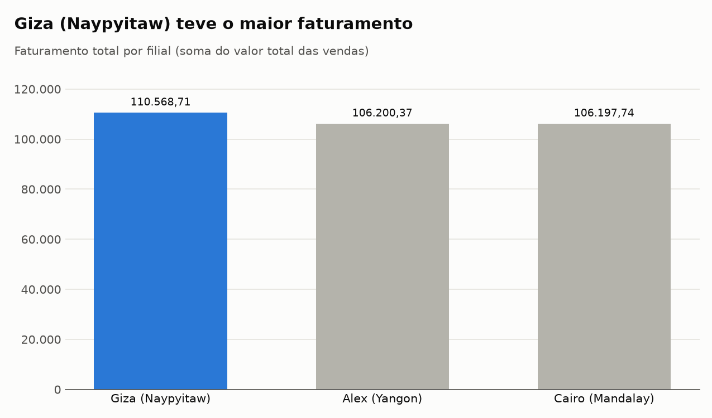
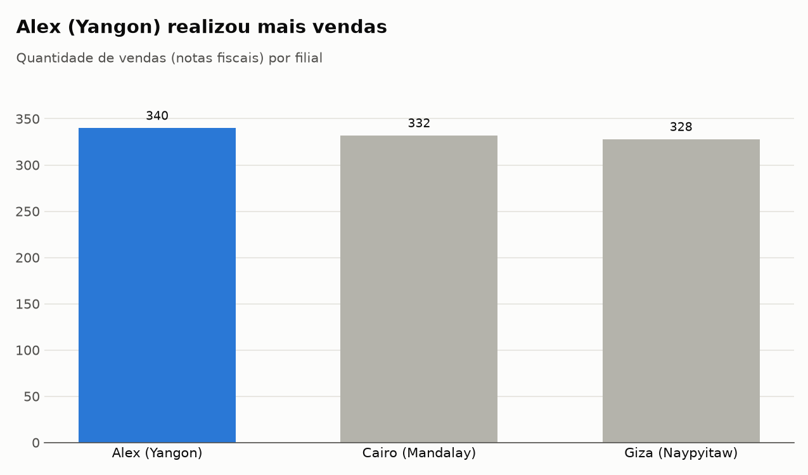
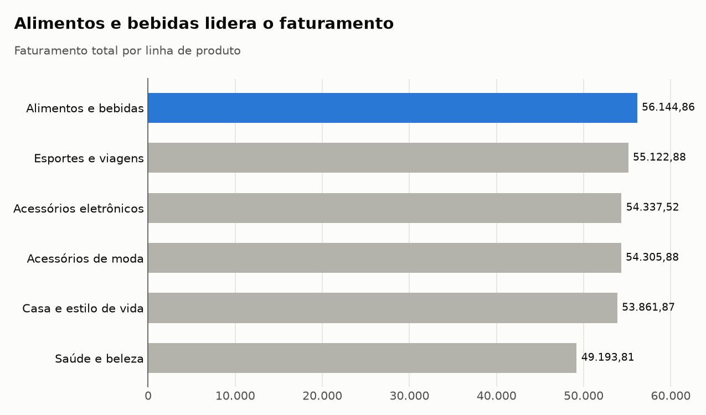
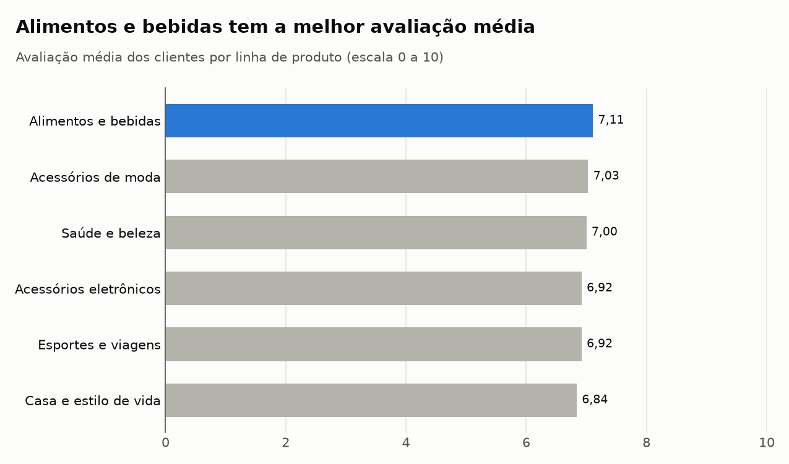
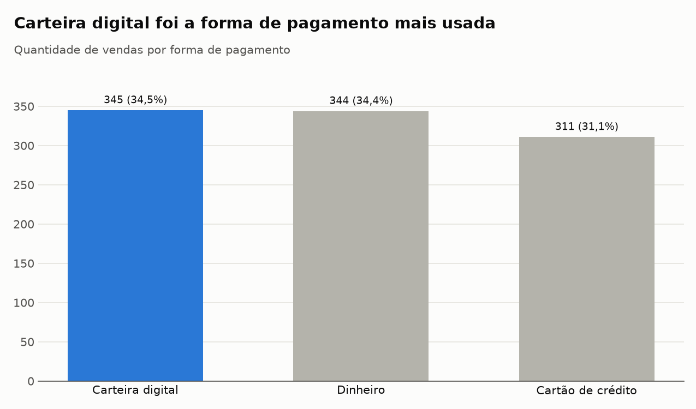
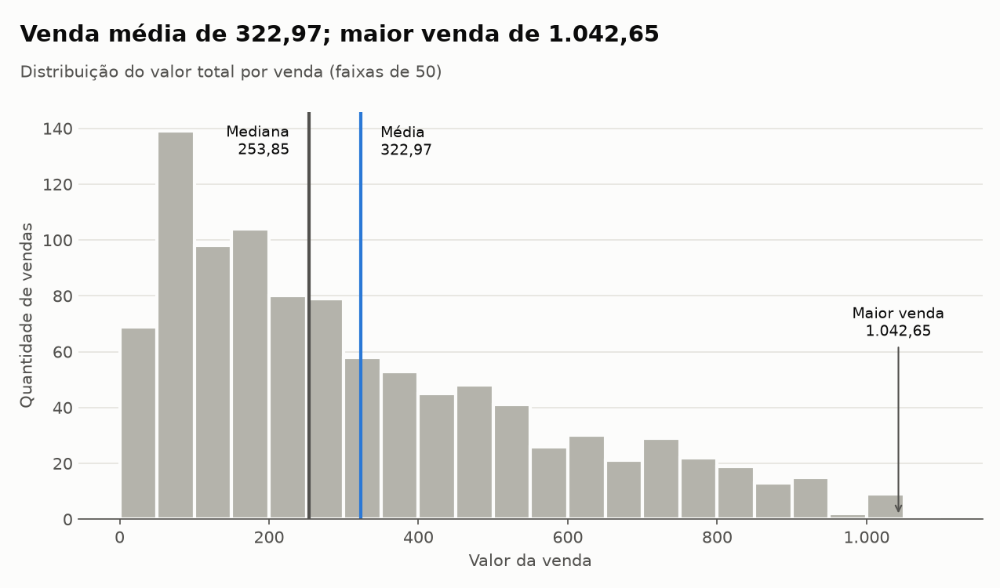
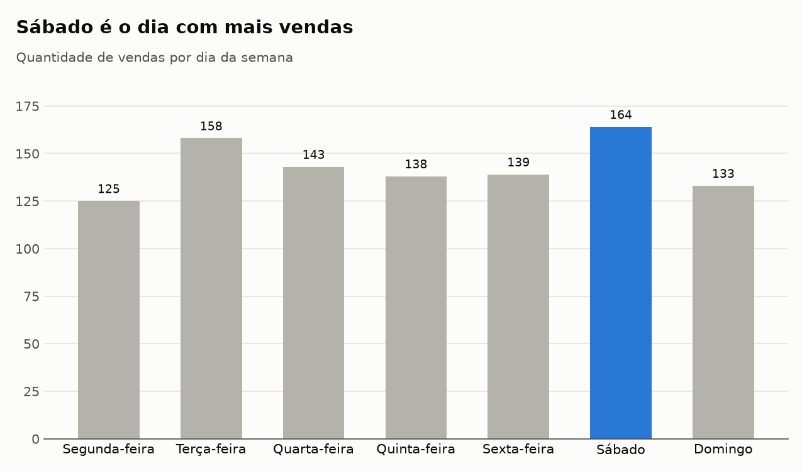
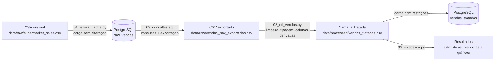

# Análise de Vendas de Supermercado com PostgreSQL e Python

Projeto Avaliativo do Módulo 1 (Análise de Dados com Python, turmas 03 e 04).

Fluxo de dados completo, inspirado na **Arquitetura Medallion**, que armazena os
dados brutos de vendas de uma rede de supermercados no **PostgreSQL** (camada Raw),
faz consultas e exportações com **SQL**, trata e tipa os dados com **Python/Pandas**
(camada Tratada) e responde a perguntas de negócio com **estatística descritiva**
e **gráficos** (Resultados).

- **Fonte dos dados:** [Supermarket Sales – Kaggle](https://www.kaggle.com/datasets/faresashraf1001/supermarket-sales)
  (1.000 vendas, 17 colunas, CSV delimitado por vírgula, período de 01/01/2019 a 30/03/2019).

---

## Sumário

1. [Respostas às perguntas de negócio](#1-respostas-às-perguntas-de-negócio)
2. [Arquitetura da solução](#2-arquitetura-da-solução)
3. [Estrutura do projeto](#3-estrutura-do-projeto)
4. [Como executar](#4-como-executar)
5. [Etapas do pipeline](#5-etapas-do-pipeline)
6. [Dicionário de dados da camada Tratada](#6-dicionário-de-dados-da-camada-tratada)
7. [Decisões de tratamento dos dados](#7-decisões-de-tratamento-dos-dados)
8. [Estatística descritiva](#8-estatística-descritiva)
9. [Boas práticas adotadas](#9-boas-práticas-adotadas)

---

## 1. Respostas às perguntas de negócio

| # | Pergunta | Resposta | Evidência |
|---|---|---|---|
| 1 | Qual filial apresentou o maior faturamento? | **Giza (Naypyitaw)** | 110.568,71 — 4,1% acima de Alex (106.200,37) |
| 2 | Qual filial realizou a maior quantidade de vendas? | **Alex (Yangon)** | 340 vendas (1.859 unidades); Cairo vem em seguida com 332 |
| 3 | Qual linha de produto apresentou o maior faturamento? | **Alimentos e bebidas** | 56.144,86 — 1,9% acima de Esportes e viagens |
| 4 | Qual linha de produto recebeu a melhor avaliação média? | **Alimentos e bebidas** | 7,11 (Acessórios de moda: 7,03) |
| 5 | Qual foi a forma de pagamento mais utilizada? | **Carteira digital** | 345 vendas (34,5%) — apenas 1 venda a mais que Dinheiro (344) |
| 6 | Qual foi o valor médio das vendas? | **322,97** | Mediana de 253,85: poucas vendas grandes puxam a média para cima |
| 7 | Qual foi a maior venda registrada? | **1.042,65** | Venda 860-79-0874: 10 × Acessórios de moda a 99,30, em Giza, 15/02/2019 |
| 8 | Em qual dia da semana ocorreu a maior quantidade de vendas? | **Sábado** | 164 vendas; terça-feira vem em seguida com 158 |

**Leitura para o negócio**

- **Giza vende menos vezes, mas vende mais caro.** É a filial com menos vendas (328) e,
  ainda assim, a de maior faturamento, com o maior ticket médio (337,10 contra 312,35 de
  Alex e 319,87 de Cairo). Alex tem mais movimento, mas vendas de menor valor.
- **Alimentos e bebidas é a linha mais forte:** lidera em faturamento e em satisfação.
  As diferenças entre as linhas, porém, são pequenas (avaliações entre 6,84 e 7,11).
- **Pagamentos equilibrados:** carteira digital e dinheiro estão praticamente empatados; o cartão de
  crédito fica um pouco atrás (31,1%).
- **Sábado e terça-feira** concentram mais vendas; segunda-feira é o dia mais fraco (125).
  A maior parte das vendas acontece à tarde (52,8%, entre 12h e 18h).

As respostas são geradas automaticamente em
[`resultados/respostas_negocio.md`](resultados/respostas_negocio.md) e também foram
calculadas diretamente em SQL ([`sql/03_consultas.sql`](sql/03_consultas.sql)), com os
mesmos resultados.

> **Nomes das categorias:** os dados (camadas Raw e Tratada e as consultas SQL) mantêm os
> valores originais do dataset, em inglês, para preservar a fidelidade à fonte. Nos
> resultados (respostas, tabelas e gráficos), as categorias são exibidas em português,
> conforme a tabela abaixo.
>
> | Coluna | Valor original | Em português |
> |---|---|---|
> | `linha_produto` | Electronic accessories | Acessórios eletrônicos |
> | `linha_produto` | Fashion accessories | Acessórios de moda |
> | `linha_produto` | Food and beverages | Alimentos e bebidas |
> | `linha_produto` | Health and beauty | Saúde e beleza |
> | `linha_produto` | Home and lifestyle | Casa e estilo de vida |
> | `linha_produto` | Sports and travel | Esportes e viagens |
> | `forma_pagamento` | Cash / Credit card / Ewallet | Dinheiro / Cartão de crédito / Carteira digital |
> | `tipo_cliente` | Member / Normal | Membro / Normal |
> | `genero` | Female / Male | Feminino / Masculino |
>
> Filiais (Alex, Cairo, Giza) e cidades (Yangon, Mandalay, Naypyitaw) são nomes próprios
> e não foram traduzidos.

### Gráficos

| | |
|---|---|
|  |  |
|  |  |
|  |  |
|  | |

Em cada gráfico, a barra em **azul** é a resposta da pergunta e as barras em cinza são o
contexto; o título já informa a conclusão.

---

## 2. Arquitetura da solução



| Camada | O que é | Onde fica |
|---|---|---|
| **Raw (Bruta)** | Cópia fiel dos dados originais do CSV, todas as colunas como `TEXT`, com rastreabilidade (arquivo de origem, número da linha e data da carga). | Tabela `raw_vendas` / `data/raw/` |
| **Tratada** | Dados limpos, tipados (`NUMERIC`, `INTEGER`, `DATE`, `TIME`), conferidos e com colunas derivadas. | `data/processed/vendas_tratadas.csv` / tabela `vendas_tratadas` |
| **Resultados** | Estatísticas descritivas, tabelas agregadas, respostas de negócio e gráficos. | `resultados/` |

---

## 3. Estrutura do projeto

```
.
├── sql/
│   ├── 01_criar_banco.sql          # Fase 0: criação do banco
│   ├── 02_criar_tabelas.sql        # Fase 0: tabelas Raw e Tratada com restrições
│   └── 03_consultas.sql            # Fase 2: consultas fundamentais e exportação CSV
├── src/
│   ├── config.py                   # caminhos, fonte dos dados e credenciais (.env)
│   ├── banco.py                    # conexão e carga no PostgreSQL
│   ├── 01_leitura_dados.py         # Fase 1: leitura, inspeção e carga Raw
│   ├── 02_etl_vendas.py            # Fase 3: limpeza, tipagem e colunas derivadas
│   └── 03_estatistica.py           # Fase 4: estatística, respostas e gráficos
├── data/
│   ├── raw/
│   │   ├── supermarket_sales.csv       # dados originais (Kaggle)
│   │   └── vendas_raw_exportadas.csv   # exportado da raw_vendas pelo SQL
│   └── processed/
│       └── vendas_tratadas.csv         # camada Tratada
├── resultados/
│   ├── 01_inspecao_inicial.txt     # relatório de inspeção do CSV
│   ├── sql_resumo_filiais.csv      # resumo por filial exportado pelo SQL
│   ├── estatisticas_descritivas.csv
│   ├── respostas_negocio.csv / .md
│   ├── tabelas/                    # agregações que sustentam cada resposta
│   └── graficos/                   # um gráfico por pergunta
├── .env.example                    # modelo das credenciais do banco
├── .gitignore
├── requirements.txt
└── README.md
```

---

## 4. Como executar

### Pré-requisitos

- Python 3.11 ou superior
- PostgreSQL 14 ou superior, com o cliente `psql` disponível no terminal
- Git

### 4.1 Preparar o ambiente

```bash
git clone <url-deste-repositorio>
cd <pasta-do-repositorio>

python -m venv .venv
source .venv/bin/activate          # Windows: .venv\Scripts\activate
pip install -r requirements.txt

cp .env.example .env               # Windows: copy .env.example .env
```

Edite o `.env` com as credenciais do seu PostgreSQL:

```ini
DB_HOST=localhost
DB_PORT=5432
DB_NAME=vendas_supermercado
DB_USER=postgres
DB_PASSWORD=sua_senha_aqui
```

### 4.2 Executar o pipeline (sempre a partir da raiz do projeto)

```bash
# Fase 0 - banco e tabelas
psql -h localhost -U postgres -d postgres            -f sql/01_criar_banco.sql
psql -h localhost -U postgres -d vendas_supermercado -f sql/02_criar_tabelas.sql

# Fase 1 - leitura, inspeção e carga da camada Raw
python src/01_leitura_dados.py

# Fase 2 - consultas SQL e exportação para CSV
psql -h localhost -U postgres -d vendas_supermercado -f sql/03_consultas.sql

# Fase 3 - transformação com Pandas (camada Tratada)
python src/02_etl_vendas.py

# Fase 4 - estatística, respostas de negócio e gráficos
python src/03_estatistica.py
```

> Os scripts SQL usam comandos do `psql` (`\gexec`, `\echo` e `\copy`). O `\copy` grava
> os arquivos exportados em caminhos relativos, por isso o `psql` deve ser executado na
> raiz do projeto. Todos os passos podem ser executados novamente sem erro: o banco só é
> criado se não existir e as tabelas são recarregadas a cada execução.

O CSV original já está versionado em `data/raw/`. Se ele for apagado, o
`01_leitura_dados.py` baixa o arquivo novamente da fonte pública.

---

## 5. Etapas do pipeline

| Fase | Arquivo | O que faz |
|---|---|---|
| 0 | `sql/01_criar_banco.sql` | Cria o banco `vendas_supermercado` (UTF-8) somente se ele ainda não existir. |
| 0 | `sql/02_criar_tabelas.sql` | Cria `raw_vendas` e `vendas_tratadas` com `PRIMARY KEY`, `NOT NULL`, `UNIQUE` e `CHECK` nomeados, e documenta tabelas e colunas com `COMMENT`. |
| 1 | `src/01_leitura_dados.py` | Lê o CSV no Pandas, gera o relatório de inspeção (dimensões, tipos, ausentes, duplicidades, categorias, formatos de data/hora) e carrega os registros **sem alteração** na `raw_vendas`. Depois lê a tabela de volta e confere, célula a célula, que o conteúdo é idêntico ao arquivo. |
| 2 | `sql/03_consultas.sql` | Consultas com `SELECT`, `WHERE`, `AND`, `BETWEEN`, `IN`, `ORDER BY`, `LIMIT`, `GROUP BY`, `HAVING`, `COUNT`, `SUM`, `AVG`, `MIN`, `MAX`, subconsulta e função de janela, respondendo às 8 perguntas direto na camada Raw. Exporta os dados brutos para `data/raw/vendas_raw_exportadas.csv` (com o cabeçalho original) e o resumo por filial para `resultados/sql_resumo_filiais.csv`. |
| 3 | `src/02_etl_vendas.py` | Padroniza colunas, limpa textos, converte tipos, trata ausentes e duplicados, confere os valores calculados, valida as restrições, cria colunas derivadas, salva o CSV tratado e carrega a `vendas_tratadas`, conferindo a quantidade de registros e a soma do faturamento. |
| 4 | `src/03_estatistica.py` | Estatística descritiva, frequências das categorias, respostas às perguntas (CSV e Markdown), tabelas agregadas e gráficos, com as categorias exibidas em português. |

### Rastreabilidade

- Cada registro da `raw_vendas` guarda o **arquivo de origem**, o **número da linha** no
  CSV e a **data/hora da carga** (`arquivo_origem`, `linha_arquivo`, `data_carga`).
- O CSV exportado pelo SQL tem o mesmo cabeçalho e os mesmos valores do original (só
  mudam detalhes de codificação: o original tem BOM e quebras de linha do Windows), o
  que comprova que nada foi alterado na carga.
- O `id_venda` (Invoice ID) é mantido em todas as camadas, permitindo seguir uma venda do
  arquivo original até o resultado.

---

## 6. Dicionário de dados da camada Tratada

| Coluna | Origem (CSV) | Tipo | Restrições / descrição |
|---|---|---|---|
| `id_venda` | Invoice ID | `VARCHAR(50)` | `PRIMARY KEY`, `NOT NULL` |
| `filial` | Branch | `VARCHAR(10)` | `NOT NULL` |
| `cidade` | City | `VARCHAR(100)` | `NOT NULL` |
| `tipo_cliente` | Customer type | `VARCHAR(50)` | — |
| `genero` | Gender | `VARCHAR(20)` | — |
| `linha_produto` | Product line | `VARCHAR(150)` | `NOT NULL` |
| `preco_unitario` | Unit price | `NUMERIC(10,2)` | `CHECK >= 0` |
| `quantidade` | Quantity | `INTEGER` | `CHECK > 0` |
| `imposto` | Tax 5% | `NUMERIC(10,2)` | `CHECK >= 0` |
| `valor_total` | Sales | `NUMERIC(12,2)` | `CHECK >= 0` (calculado / conferido) |
| `data_venda` | Date | `DATE` | Convertido de texto (M/D/AAAA) para data |
| `hora_venda` | Time | `TIME` | Convertido de texto (H:MM:SS AM/PM) para horário |
| `forma_pagamento` | Payment | `VARCHAR(50)` | `NOT NULL` |
| `custo_mercadoria` | cogs | `NUMERIC(12,2)` | `CHECK >= 0` |
| `margem_percentual` | gross margin percentage | `NUMERIC(10,2)` | — |
| `receita_bruta` | gross income | `NUMERIC(12,2)` | `CHECK >= 0` |
| `avaliacao` | Rating | `NUMERIC(4,2)` | `CHECK` entre 0 e 10 |

**Colunas derivadas** (presentes em `data/processed/vendas_tratadas.csv`):

| Coluna | Descrição |
|---|---|
| `mes` / `nome_mes` | Número e nome do mês da venda |
| `num_dia_semana` / `dia_semana` | Dia da semana (1 = segunda-feira) e seu nome em português |
| `hora` | Hora cheia da venda (0–23) |
| `periodo_dia` | Manhã (antes das 12h), Tarde (12h–17h59) ou Noite (a partir das 18h) |

---

## 7. Decisões de tratamento dos dados

A inspeção inicial ([`resultados/01_inspecao_inicial.txt`](resultados/01_inspecao_inicial.txt))
mostrou um dataset sem ausentes e sem duplicidades, mas com pontos que exigem tratamento.
Mesmo assim, o ETL foi escrito para lidar com dados sujos, e cada etapa informa no
terminal o que encontrou e o que alterou.

| Situação | Tratamento |
|---|---|
| Colunas em inglês, com espaços e símbolos (`Tax 5%`) | Renomeadas para `snake_case` em português, conforme o dicionário. |
| Datas como texto no formato americano (`1/5/2019`) | Convertidas com formato explícito `%m/%d/%Y`, evitando a troca de dia e mês. |
| Horas como texto em 12h (`1:08:00 PM`) | Convertidas com `%I:%M:%S %p` para `TIME` (`13:08:00`). |
| Espaços extras e textos vazios | Removidos nas pontas; texto vazio passa a ser ausente (`NULL`). |
| Valores numéricos inválidos | Viram ausentes e são contados como falha de conversão. Quantidade não inteira também é considerada inválida. |
| Ausentes em campos obrigatórios (`NOT NULL`, preço e quantidade) | Registro removido, pois não há como estimar o valor. |
| Ausentes em campos calculáveis (imposto, total, custo, receita, margem) | Recalculados a partir do preço e da quantidade. |
| Ausentes em campos opcionais (tipo de cliente, gênero, data, hora, avaliação) | Mantidos como nulos: a tabela aceita e imputar valores distorceria as estatísticas. |
| Duplicidades | Removidas as linhas idênticas e, depois, as repetições de `id_venda` (chave primária). |
| Conferência do `valor_total` | `valor_total = preço × quantidade + 5% de imposto`; também são conferidos custo, imposto, receita e margem. Diferenças acima de 1 centavo são recalculadas. Resultado: 1.000 de 1.000 vendas conferidas sem divergência. |
| Mais de 2 casas decimais (`Tax 5%`, `Sales`, `gross income` têm 4; a margem tem 9) | Arredondadas para 2 casas, como definem os tipos `NUMERIC(x,2)`. |
| Restrições `CHECK` e tamanho dos `VARCHAR` | Validadas no Pandas antes da carga; registros que violariam a tabela são removidos e contados. |

Resultado: **1.000 registros lidos → 1.000 registros tratados (0 removidos).**

> **Observação sobre arredondamento:** as consultas SQL somam os valores brutos (4 casas
> decimais), enquanto o Pandas soma os valores já arredondados para 2 casas. Por isso
> alguns totais diferem em poucos centavos (ex.: faturamento total de 322.966,75 no SQL e
> 322.966,82 na camada Tratada). Nenhuma resposta muda por causa disso.

---

## 8. Estatística descritiva

Arquivo completo: [`resultados/estatisticas_descritivas.csv`](resultados/estatisticas_descritivas.csv)
(contagem, média, mediana, moda, desvio padrão, variância, mínimo, quartis, máximo,
amplitude, coeficiente de variação e assimetria).

| Coluna | Média | Mediana | Desvio padrão | Mínimo | Máximo | Coef. de variação |
|---|---|---|---|---|---|---|
| preco_unitario | 55,67 | 55,23 | 26,49 | 10,08 | 99,96 | 47,6% |
| quantidade | 5,51 | 5 | 2,92 | 1 | 10 | 53,1% |
| valor_total | 322,97 | 253,85 | 245,89 | 10,68 | 1.042,65 | 76,1% |
| custo_mercadoria | 307,59 | 241,76 | 234,18 | 10,17 | 993,00 | 76,1% |
| receita_bruta | 15,38 | 12,09 | 11,71 | 0,51 | 49,65 | 76,1% |
| avaliacao | 6,97 | 7,00 | 1,72 | 4,00 | 10,00 | 24,7% |

- O **valor das vendas** tem média bem acima da mediana e assimetria positiva (0,89):
  a maioria das vendas é de valor baixo/médio e poucas vendas grandes elevam a média.
- **Preço, quantidade e avaliação** são simétricos (média ≈ mediana).
- A **margem percentual** é constante (4,76%) em todas as vendas, o que é uma
  característica do dataset.
- Perfil das vendas: 56,5% de clientes membros, 57,1% do gênero feminino e 52,8% das
  vendas no período da tarde ([`resultados/tabelas/frequencias_categoricas.csv`](resultados/tabelas/frequencias_categoricas.csv)).

---

## 9. Boas práticas adotadas

- **Credenciais protegidas:** a senha do banco fica apenas no `.env`, que está no
  `.gitignore`; o repositório traz somente o modelo `.env.example`.
- **`.gitignore`** cobre `.env`, ambientes virtuais, `__pycache__`, arquivos de IDE e logs.
- **Código organizado:** cada script corresponde a uma fase e é dividido em funções
  pequenas; configurações e acesso ao banco ficam em módulos compartilhados
  (`config.py` e `banco.py`); código em conformidade com o **PEP 8** (verificado com
  `pycodestyle`, limite de 79 colunas).
- **Segurança no banco:** na carga, nomes de tabela e colunas são montados com
  `psycopg2.sql.Identifier` e os valores são enviados como parâmetros (nunca
  concatenados no SQL); cada carga é feita em uma transação única (se uma linha
  falhar, nada é gravado).
- **Reprodutibilidade:** versões fixadas no `requirements.txt` e scripts que podem ser
  executados várias vezes com o mesmo resultado.
- **Versionamento:** commits pequenos e descritivos, um por etapa do projeto.

### Tecnologias

PostgreSQL 17 · SQL · Python 3.12 · Pandas · Matplotlib · psycopg2 · python-dotenv · Git/GitHub

---

> Versão desenvolvida com o assistente de IA Claude Code, a partir do enunciado do projeto,
> para comparação com a solução feita manualmente.
